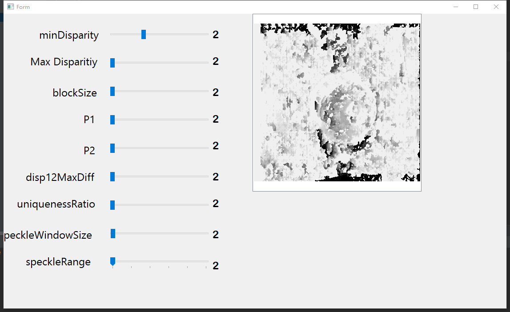

# stereoMatchingpython
Tunning parameters for stereo maching based on CV2.StereoSGBM_create.
## Packages:
Listed in package-list.txt  .Use anoconda to create virtual enviroment .The main packages is cv2 , matplotlib,pyqt5
## Usage: 
After installing packages , run main.py .The first prompt window should  choose left image .The second prompt window should choose right image.The main window should be like 
.
Then tuning your parameters !

If you want  me to add more parameter or other algo .Create it in issue.

Some code is borrowed from "Marcel Goldschen-Ohm <marcel.goldschen@gmail.com>"
 
